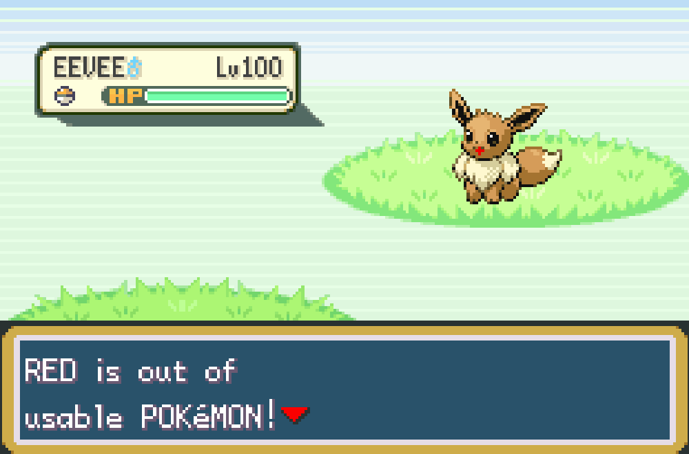
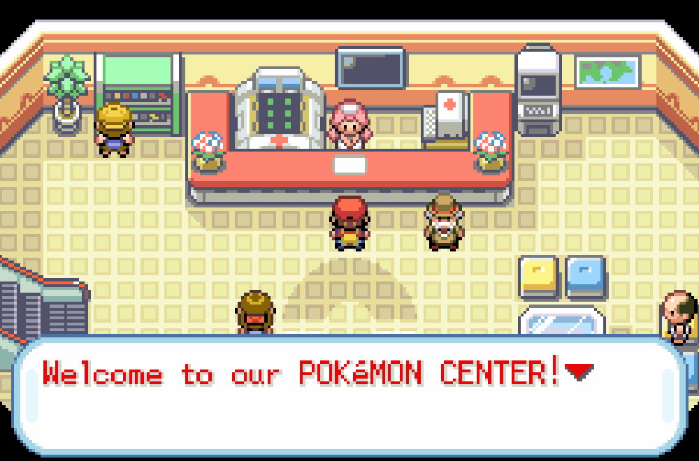
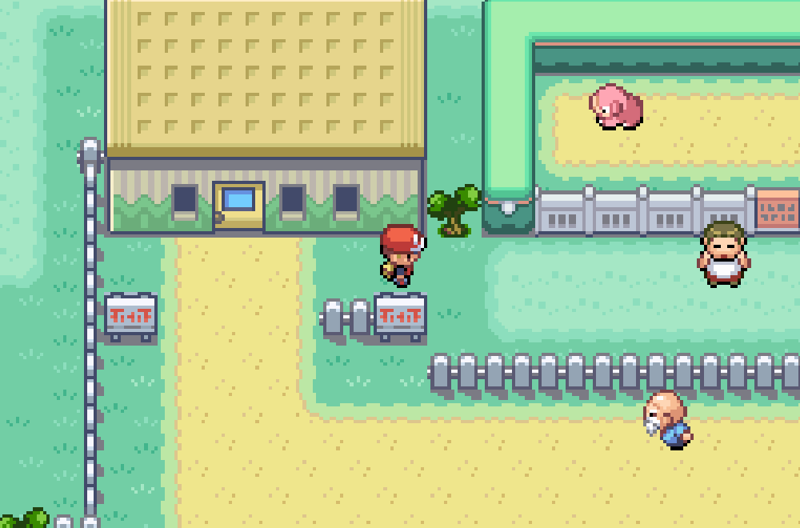
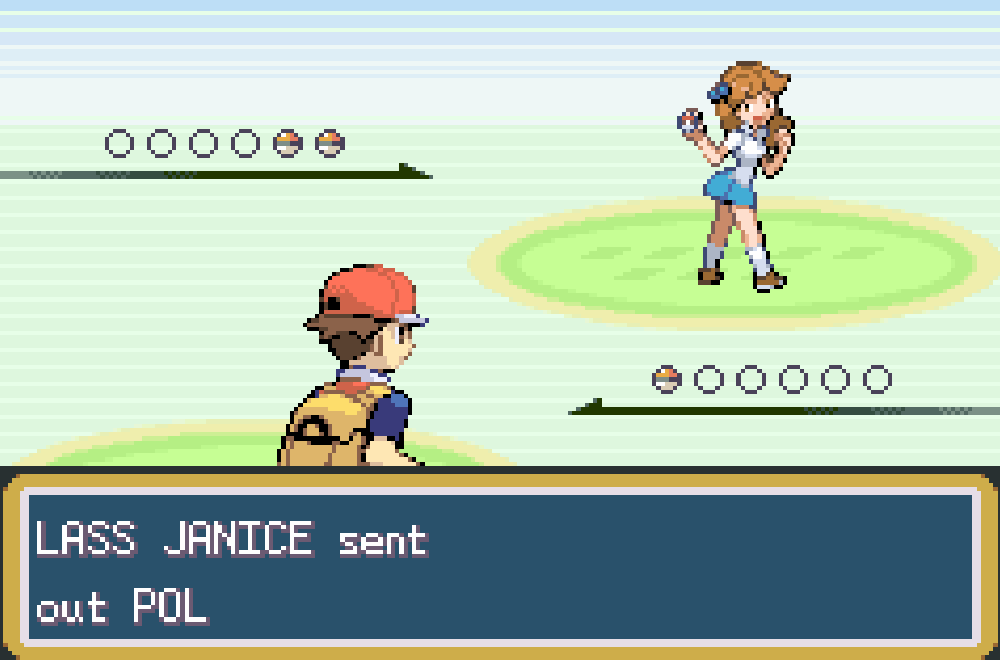

# Pokemon IRONéMON Red Kaizo Edition

This is a Rom hack of the Ironémon challenge created by [Iateyourpie](https://www.twitch.tv/iateyourpie). An Ironémon is a set of self-imposed rules designed the make the pokemon games more challenging. This ROM hack enforces those rules into the game itself. The ROM hack takes a few liberties, for the original ruleset see [Original Ironmon rules](https://gist.github.com/valiant-code/adb18d248fa0fae7da6b639e2ee8f9c1)

[Custom Tracker for this patch is here](https://github.com/U-K-L/Ironmon-Tracker)

## IRONéMON Red Kaizo Ruleset 

| Rule                          | Details                                                                                                                                                                                                                                                                                                                                                                                       | Notes                                                                                                                                                                  |
|-------------------------------|-----------------------------------------------------------------------------------------------------------------------------------------------------------------------------------------------------------------------------------------------------------------------------------------------------------------------------------------------------------------------------------------------|------------------------------------------------------------------------------------------------------------------------------------------------------------------------|
| <h2>**Game Over**<h2>|Once all Pokemon have fainted your adventure ends. Back to your mother you go, ready to start your career all over again!                                                                                                                                                                                                                                                                      | Although your journey may have restarted. Your attempts are recorded as well as your playtime. Each retry re-randomizes everything! 
| <h2>**1 Pokemon**<h2>|Only one pokemon allowed in the party. If you catch a new pokemon, it automatically swaps!                                                                                                                                                                                                                                                                           | There is no way to utilize the PC whatsoever. You can only pivot via catching a pokemon.                                                                     |   
| <h2>**No Free Healthcare 😰😱☠**<h2>    |You heard that right! No more free heals, no more free treatment! Pokemon Centers now cost cash to heal.                                                                                                                                                                                                                                              |Each usage increases the cost. Other heals such as beds and your mother no longer work~                                                                                                                                                                        |
| <h2>**Oops Its All Random!**<h2>|Everything is randomized! Wild Encounters, Trainer's party, Evolutions, TM/HMs you can learn, Stat spread, Abilities and more...                                                                                                                                                                                                                                                                           | Evolutions will always pick a pokemon of a similar type, and overall stats that are higher. Special trainers will have specific parties that they randomly choose Pokemon from. Stat spreads retain original BST.                                                                    |
| <h2>**Catch 1 Per Area**<h2>    | You can only catch one Pokemon per area. An area is where you have met in the game. This can be routes and caves.                                                                                                                                                                                                                                              |Pokemon scale to the level of the current pokemon in the party. Repels always work.                                                                                                                                                                        |
| <h2>**HM Slavery Abolished**<h2>    | No need for HM slaves, once you have the badge you can use the HM.                                                                                                                                                                                                                                              |Hehe, only HMs required to complete the game. Fly and Flash aren't included...                                                                                                                                                                 |
| <h2>**Strong, Independent, Pokemon 📢🔊**<h2>    | They don't need no human! Strong Pokemon will disobey you, and obey when they feel like it.                                                                                                                                                                                                                                               |Pokemon 580 BST and higher will begin disobeying. Each Pokemon disobeys according to its BST, the higher the more chance it will disobey.                                                                                                                                                               |                                                                    |                                                                                                                                 |                                                                                                                                                                                                                                                                                     |